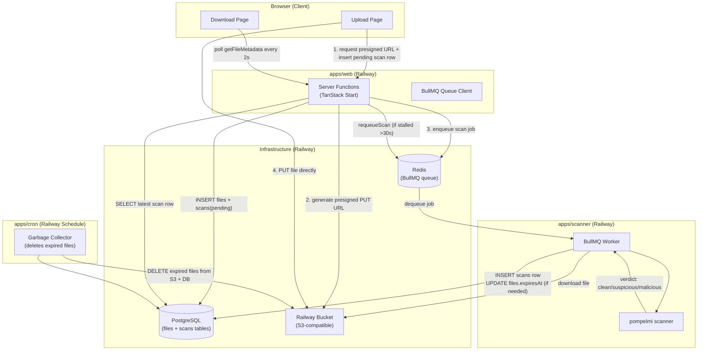
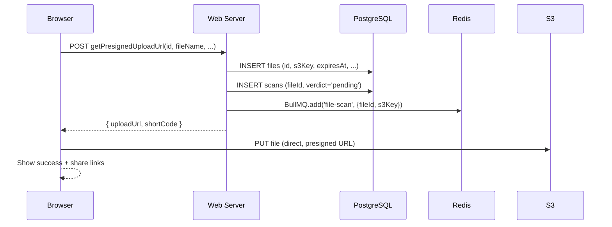
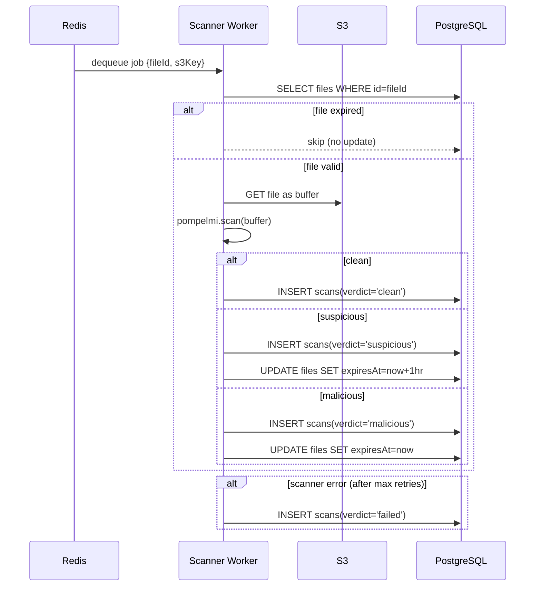
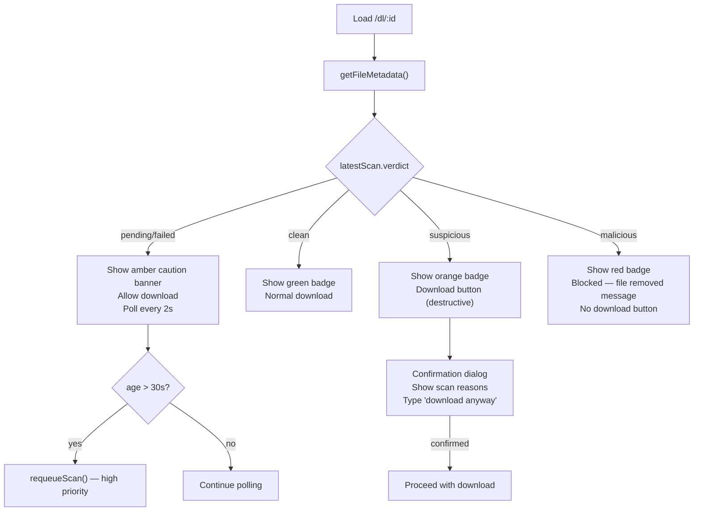
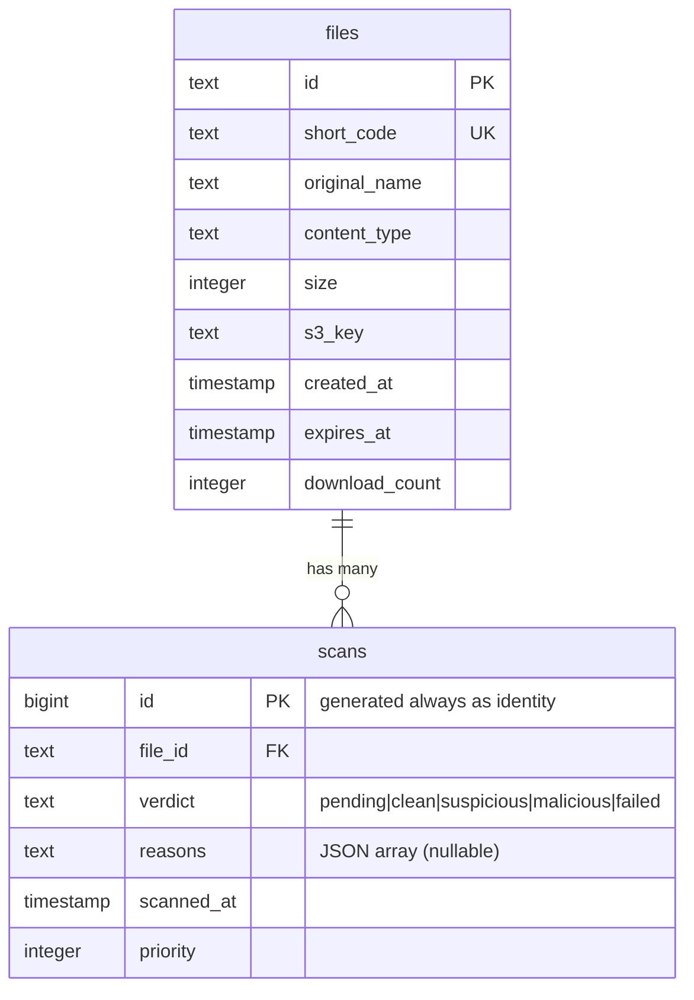

# Sendy — System Architecture

## Overview

Sendy is an anonymous file sharing service built on Railway. Files are uploaded directly to S3-compatible storage, scanned asynchronously for malware, and shared via short codes or 3-word IDs.

---

## System Diagram

---

## Upload Flow

---

## Scan Flow

---

## Download Page — Verdict UX

---

## Data Model

---

## Services

| Service          | Runtime                | Role                                          |
| ---------------- | ---------------------- | --------------------------------------------- |
| `apps/web`       | Bun + TanStack Start   | Web UI + server functions + queue enqueuer    |
| `apps/scanner`   | Bun                    | BullMQ worker — downloads, scans, updates DB  |
| `apps/cron`      | Bun (Railway Schedule) | GC — deletes expired files from S3 + DB       |
| Railway Redis    | Redis                  | BullMQ job queue (reusable for caching later) |
| Railway Postgres | PostgreSQL             | `files` + `scans` tables                      |
| Railway Bucket   | S3-compatible          | File storage                                  |

---

## Scan Verdict Lifecycle

| Verdict      | Meaning                     | Download                     | Expiry impact                  |
| ------------ | --------------------------- | ---------------------------- | ------------------------------ |
| `pending`    | Queued, not yet scanned     | Allowed (caution)            | None                           |
| `clean`      | Passed all scanners         | Normal                       | None                           |
| `suspicious` | Heuristic flags raised      | Allowed (typed confirmation) | `expiresAt = now + 1hr`        |
| `malicious`  | Definitive threat detected  | **Blocked**                  | `expiresAt = now` (GC deletes) |
| `failed`     | Scanner error after retries | Allowed (caution)            | None                           |
